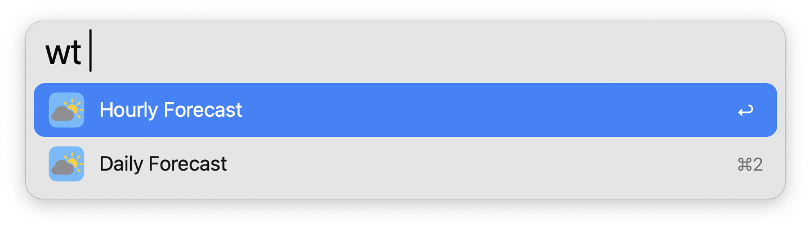
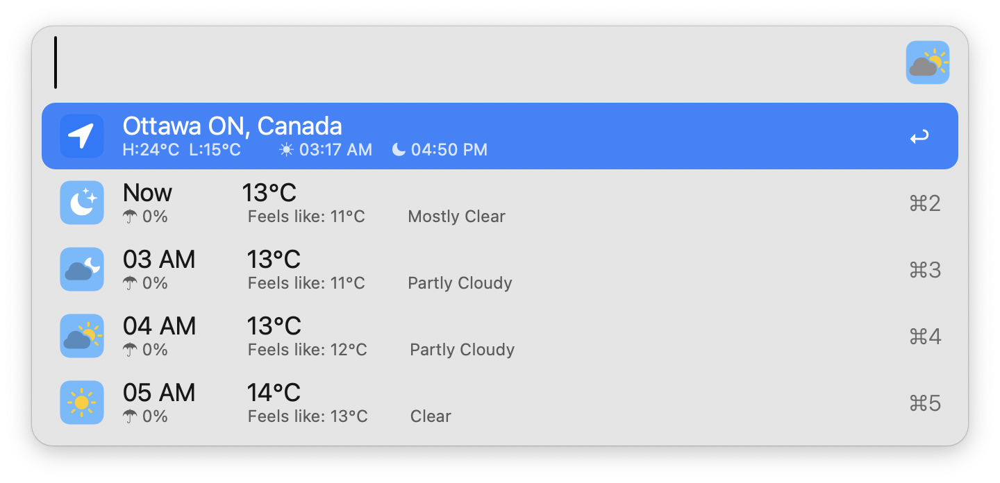
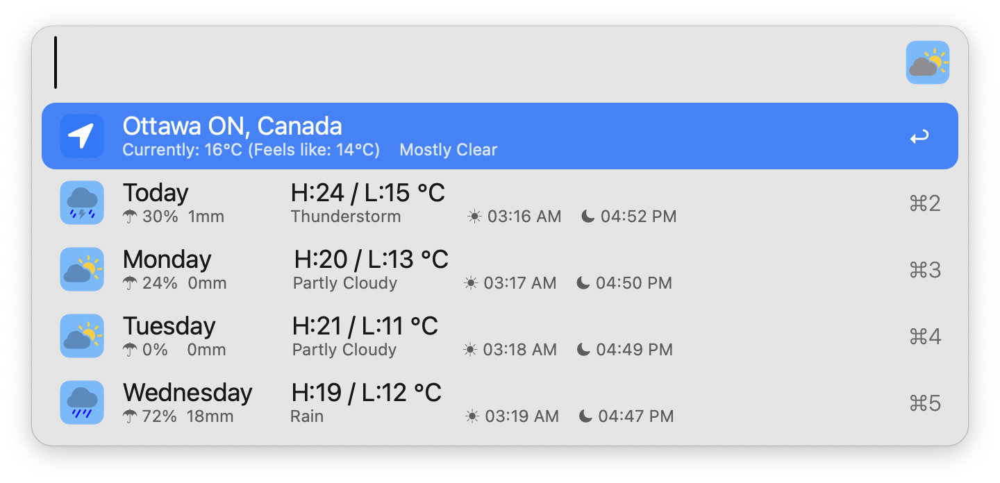

#  Mini Weather

Glance Weather &amp; Forecast Data in Alfred

## Setup

**Note**: This workflow requires [jq](https://jqlang.github.io/jq/) to function, which comes preinstalled on macOS 15 Sequoia and later.

## Usage

View local weather information with the `wt` keyword. Select between hourly or daily forecasts.

Configure the [Hotkeys](https://www.alfredapp.com/help/workflows/triggers/hotkey/) as shortcuts for viewing each forecast type.